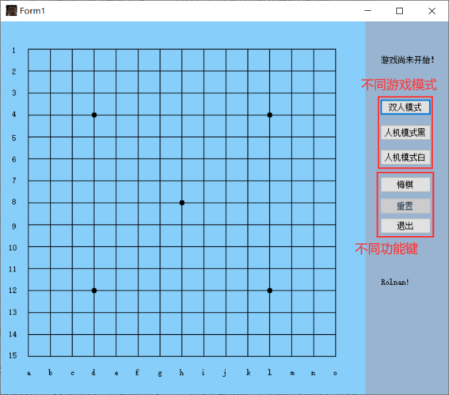
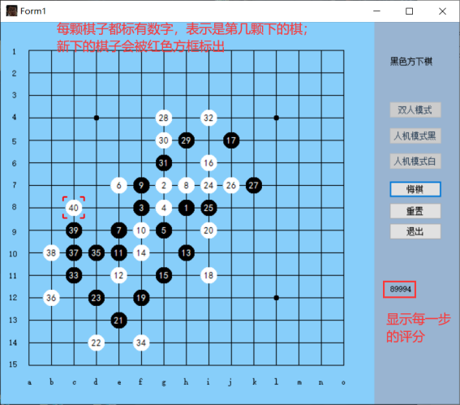

## c#可视化五子棋，采用$\alpha-\beta$剪枝实现电脑方

- 五子棋的人机博弈是two-agent对抗搜索算法的一个很具有标志性的应用，类似于其他的各种棋类问题，五子棋问题的求解最终都趋向于Minimax算法（极小化极大算法）。本次实验即利用这一算法给出了五子棋棋局形势的评价函数，通过该评价函数对当前棋局进行层次搜索，最终确定落子位置。
- 为了节约搜索时长，本次实验的搜索树采用了α-β剪枝算法，剪去了不会改变最终决策的分支，避免了大量无谓的计算。同时，本项目小组还根据五子棋的特点对普适的α-β剪枝算法进行了优化，例如不对周围八个位置没有棋的格点进行搜索等。
- 而在用户UI方面，本次实验采用了c#来实现，通过使用c#提供的一系列图形界面封装函数，可以实现鼠标点击位置的检测，从而实现简单的UI交互。

****

****

